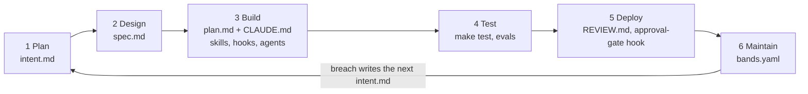

# ai-native-sdlc-playbook

**The AI-Native SDLC playbook, as a repository you can clone and run.**

[](LICENSE)
[](https://claude.com/blog/the-ai-native-sdlc-playbook)
[](#verification)

Anthropic's [The AI-Native SDLC playbook](https://claude.com/blog/the-ai-native-sdlc-playbook)
(Louis Claxton, August 21, 2026) describes a six-stage loop where every stage
ends by committing a file that the next stage reads: `intent.md`, `spec.md`,
`plan.md`, the diff and its tests, the PR with its review findings, and a
breached control band that writes the next `intent.md`. The article prints the
config files but ships no repository.

This is that repository. Every code block from the article is here, verbatim,
at the path the article names. The blanks the article leaves (templates, a
single test command, a minimal eval suite) are filled with the smallest thing
that lets the article's own files run unmodified. The repo was built by running
its own bootstrap through the loop, and the stage-by-stage commit record is
kept on the [`history`](https://github.com/imsungbin/ai-native-sdlc-playbook/commits/history)
branch, so the worked example is real, not a fiction.

Unofficial. Not affiliated with or endorsed by Anthropic.

## The loop



| Stage | Artifact | Where it lives here |
| --- | --- | --- |
| Plan | intent.md | intent/&lt;NNNN&gt;-&lt;slug&gt;/intent.md |
| Design | spec.md | intent/&lt;NNNN&gt;-&lt;slug&gt;/spec.md |
| Build | plan.md, CLAUDE.md, skills, hooks, agents | intent/.../plan.md, CLAUDE.md, .claude/ |
| Test | feedback loop, evals | Makefile to scripts/validate.sh, evals/, .github/workflows/agent-evals.yml |
| Deploy | REVIEW.md, approval-gate hook | REVIEW.md, .claude/settings.json, .claude/hooks/production-gate.sh |
| Maintain | bands.yaml, intent.md again | bands.yaml, .claude/skills/intent-template/ |

The chain of commits is the audit trail: who asked for what, what the agent
produced, who approved it.

## Quickstart

```
git clone https://github.com/imsungbin/ai-native-sdlc-playbook.git
cd ai-native-sdlc-playbook
make test
```

Expected last line: `validate: all checks passed`.

Then open Claude Code in the directory. `CLAUDE.md`, both skills, the
`verifier` agent, the `/spec` command, and the production-gate hook are all
live from the first session.

## What is inside

```
.
├── CLAUDE.md                          conventions, commands, verification block
├── REVIEW.md                          review passes, Important vs nit, nit cap
├── bands.yaml                         control-band tiers for Stage 6
├── .claude/
│   ├── settings.json                  PreToolUse hook wiring
│   ├── hooks/production-gate.sh       blocks production deploys without approval
│   ├── skills/secure-api-review/      the article's example policy skill
│   ├── skills/intent-template/        writes intent.md from templates/intent.md
│   ├── agents/verifier.md             the article's example subagent
│   └── commands/spec.md               the article's Stage 2 prompt as /spec
├── .github/workflows/agent-evals.yml  continuous evals, verbatim
├── evals/                             one eval and check.sh so the workflow runs
├── templates/                         intent.md, spec.md, plan.md skeletons
├── intent/                            this repo's own loop record (two changes)
├── examples/article/                  the article's illustrations, for reference
├── AGENTS.md, .agents/skills          symlinks for non-Claude coding agents
└── Makefile, scripts/validate.sh      the single feedback-loop command
```

## Run one change through the loop

1. **Plan.** In Claude Code, ask for an intent. The `intent-template` skill
   triggers and writes `intent/<NNNN>-<slug>/intent.md`. Review it, then commit
   it on its own.
2. **Design.** Run the slash command, review the result, commit `spec.md`.

   ```
   /spec intent/0001-your-change/intent.md
   ```

3. **Build.** Start Claude Code in plan mode, give it `intent.md` and
   `spec.md`, iterate until the plan stands on its own, commit `plan.md`, then
   implement.
4. **Test.** Run `make test` before calling anything done. The verification
   block in `CLAUDE.md` enforces this by instruction.
5. **Deploy.** `REVIEW.md` drives the review passes. `production-gate.sh`
   blocks any Bash command containing both "deploy" and "production" unless
   `RELEASE_APPROVAL` is set.
6. **Maintain.** `bands.yaml` holds the response tiers. Your detection script
   (not shipped here, see below) writes the next `intent.md` through the
   `intent-template` skill.

## Adopt it in your own repository

1. Copy `CLAUDE.md` (rewrite it for your codebase, keep the article's
   structure), `REVIEW.md`, `bands.yaml`, `.claude/`, `templates/`, `evals/`,
   and the `Makefile` target or an equivalent single test command.
2. Walk the [file map](#file-map). Each row says what an adopter replaces.
3. Set the `ANTHROPIC_API_KEY` repository secret, or disable the "Agent evals"
   workflow. Its nightly schedule fails without the secret.
4. If you use a coding agent other than Claude Code, it finds the same
   instructions at `AGENTS.md` and the same skills under `.agents/skills/`;
   both are symbolic links. On Windows, set `git config core.symlinks true`
   before cloning, or they check out as text files.

## This repository's own loop record

`intent/0001-bootstrap-playbook-repo/` is the real record of building this
repository, not a worked fiction. The three files were committed in stage order,
one commit each, before the repository they describe was finished.

`main` was squashed to a single commit at publication. The stage-by-stage
history is preserved unchanged on the `history` branch and at tag `v0.1.0`:

```
git fetch origin history
git log --reverse --format='%h %ad %s' --date=short origin/history
```

The first three commits are the intent, the spec, and the plan.
`intent/0002-multi-agent-entry-points/` is the second change run through the
same loop, again committed intent, spec, plan, then build.

## File map

| Path | Origin | What to change for your org |
| --- | --- | --- |
| README.md | Authored | Rewrite for your repository. |
| LICENSE | Authored | Your copyright holder, or your own license. |
| CLAUDE.md | Authored | Rewrite entirely for your codebase; keep the structure and the verification block. |
| AGENTS.md | Authored, symlink to CLAUDE.md | Keep if you run agents that read `AGENTS.md`; otherwise delete. |
| .agents/skills | Authored, symlink to .claude/skills | Keep if you run agents that scan `.agents/skills/`; otherwise delete. |
| REVIEW.md | Article, verbatim | Adjust the "Do not report" paths (`src/gen/` is the article's example) and the nit cap. |
| bands.yaml | Article, verbatim | Your metric, your baseline window, and the routes your agent may take. |
| Makefile | Authored | Point `test` at your real test command. |
| .gitignore | Authored | Add whatever your toolchain drops. |
| .claude/settings.json | Article, verbatim | Add your own gates; non-negotiable ones belong in managed settings instead. |
| .claude/hooks/production-gate.sh | Article, verbatim | Define what counts as approval in your change process. |
| .claude/skills/secure-api-review/SKILL.md | Article, verbatim | Replace with your own API security policy, and supply the `scripts/check-endpoints.sh` it calls. |
| .claude/skills/intent-template/SKILL.md | Authored | Keep if you keep `templates/intent.md`; otherwise point it at your template. |
| .claude/agents/verifier.md | Article, verbatim | Replace `make run` with the command that starts your app. |
| .claude/commands/spec.md | Article prompt, verbatim, plus one authored line | Name your own skills and standards in the prompt. |
| .github/workflows/agent-evals.yml | Article, verbatim | Needs an `ANTHROPIC_API_KEY` secret; adjust the schedule and the allowed tools. |
| evals/check.sh | Authored | Extend the checks your evals need. |
| evals/001-verification-command.json | Authored | Replace with 20 to 50 real tasks from your recent work. |
| scripts/validate.sh | Authored | Replace with your real test suite, or drop it once you have one. |
| templates/intent.md | Authored | Your organization's agreed intent fields. |
| templates/spec.md | Authored | Your organization's agreed spec fields. |
| templates/plan.md | Authored | Your organization's agreed plan fields. |
| intent/0001-bootstrap-playbook-repo/intent.md | Authored, this repo's own record | Delete; start your own `intent/0001-...`. |
| intent/0001-bootstrap-playbook-repo/spec.md | Authored, this repo's own record | Delete. |
| intent/0001-bootstrap-playbook-repo/plan.md | Authored, this repo's own record | Delete. |
| intent/0002-multi-agent-entry-points/intent.md | Authored, this repo's own record | Delete. |
| intent/0002-multi-agent-entry-points/spec.md | Authored, this repo's own record | Delete. |
| intent/0002-multi-agent-entry-points/plan.md | Authored, this repo's own record | Delete. |
| examples/article/README.md | Authored | Delete with the folder. |
| examples/article/intent.md | Article, verbatim | Reference only; the article's fictional example. |
| examples/article/plan.md | Article, verbatim | Reference only; the article's fictional example. |
| examples/article/CLAUDE.md | Article, verbatim | Reference only; the article's payments-service example plus its verification block. |
| examples/article/managed-settings.json | Article, same JSON re-indented | Reference only; managed settings are deployed by MDM or the admin console, not from a repository. |
| examples/article/triage-step.yml | Article, verbatim | Reference only; the article's pipeline triage step. |

## Author's calls (decisions the article does not make)

1. One directory per change, `intent/<NNNN>-<slug>/`, holding the triple. The
   article calls for "an intent/ folder in the product repo" and for committing
   `spec.md` alongside `intent.md`. Adding `plan.md` keeps the whole audit trail
   for one change in one place.
2. The `templates/spec.md` headings. The article ships no `spec.md`, only the
   prompt that produces one, so the headings come from what that prompt asks for
   and what its review step checks.
3. The Stage 2 prompt lives at `.claude/commands/spec.md` with one line prepended
   naming the file argument. The article says to "codify it as an
   organization-level slash command" but does not print the command file.
4. The intent template is a skill that references `templates/intent.md`. Article
   Stage 1 step 3 calls for "the organization's template, which can be encoded as
   a skill." The same skill covers Stage 6, where the agent writes its diagnosis
   as an `intent.md` in the Stage 1 format.
5. `make test`, running `scripts/validate.sh`, is this repository's single
   feedback-loop command. Article Stage 4 step 1 requires one command that exits
   non-zero on failure but does not say what it should check in a repository like
   this one.
6. A minimal `evals/`, one eval and one `check.sh`, so the article's
   `agent-evals.yml` runs unchanged over `evals/*.json`.
7. `examples/article/` holds the article's illustrations that are not live
   configuration here, and the article's two `CLAUDE.md` blocks are concatenated
   into one file because they are two sections of the same file.
8. `bands.yaml` sits at the repository root. The article prints the file but does
   not say where it lives, and the deterministic detection script it configures is
   not shipped here (see the next section).
9. This repository's own bootstrap is run through the loop for real, in stage
   order, as the worked example, instead of inventing a fictional project. That
   commit chain lives on the `history` branch; `main` starts from one commit.
10. `AGENTS.md` and `.agents/skills` are symbolic links to `CLAUDE.md` and
    `.claude/skills`. The article is written for Claude Code and places
    institutional knowledge in those two locations; other coding agents read
    `AGENTS.md` and scan `.agents/skills/`. Links give them the same files with
    one source of truth and no copy to drift.

## What this repo does not contain, and why

Product features, not files. The article describes these, but they are configured
in Anthropic's products or in an organization's admin surface rather than in a
repository, so they are out of scope here and are not faked.

- MCP wiring for deployment tooling and legacy systems (Stage 5 CI/CD step 4;
  the Stage 3 sidebar on legacy systems and the source of truth).
- Sandboxing and managed settings (Stage 5, "Managed settings for a regulated
  enterprise"). The JSON is kept under `examples/article/` for reference only,
  since managed settings are deployed by MDM or the admin console and a file in a
  repository cannot enforce them.
- Claude Security recurring codebase scans (Stage 6).
- Claude Tag on call in Slack (Stage 6).

Described in prose, with no code in the article. Write your own; the article
states what each must do.

- The Stage 6 detection script: deterministic, rolling mean and standard
  deviation, Western Electric rules, unit tested, with no model involved.
- The Stage 4 hook that blocks edits to test files during a fix task.
- The Stage 3 hook that keeps `plan.md` in sync with the diff.
- The Stage 5 slash command that babysits a PR to green.
- The managed Code Review service or the `claude-code-action` wiring.
- Claude Design mocks (Stage 2).

## Verification

`make test` runs `scripts/validate.sh`, which checks that:

- every file this repository is meant to contain exists and is non-empty;
- `AGENTS.md` and `.agents/skills` are symbolic links pointing at `CLAUDE.md`
  and `../.claude/skills` and resolve;
- `production-gate.sh`, `evals/check.sh` and `scripts/validate.sh` pass
  `bash -n` and are executable;
- `.claude/settings.json`, `examples/article/managed-settings.json` and every
  `evals/*.json` parse as JSON, and every eval carries a string `prompt`;
- `bands.yaml`, `agent-evals.yml` and `triage-step.yml` parse as YAML (skipped
  with a warning if neither a Python `yaml` module nor ruby is available);
- the production gate exits 2 on a production deploy with no `RELEASE_APPROVAL`,
  exits 0 with it, and exits 0 on an unrelated command;
- both `SKILL.md` files and `agents/verifier.md` open with frontmatter carrying a
  `name:` line;
- `REVIEW.md`, `CLAUDE.md` and the templates start with a markdown heading.

It prints one line per check and ends with `validate: all checks passed`. Any
failure prints `FAIL:` and exits 1.

## Contributing

The bar for a change is the article. If the article describes it and it can
live in a repository, it belongs here at the path the article names. If the
article does not describe it, it goes under "Author's calls" with the reason,
or it does not go in. Run a change through the loop the way the two existing
`intent/` directories did, and run `make test` before opening a PR.

If this saved you an afternoon of copying code blocks out of a blog post, a
star helps the next person find it.

## Attribution and license

The article and the code blocks reproduced here are by Louis Claxton and are
copyright Anthropic. They are reproduced for reference, with attribution and
unmodified, in
[The AI-Native SDLC playbook](https://claude.com/blog/the-ai-native-sdlc-playbook).
Everything authored in this repository is MIT licensed; see [LICENSE](LICENSE).
