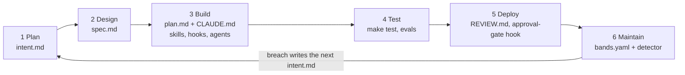

# ai-native-sdlc-playbook

**The AI-Native SDLC playbook: the article's files verbatim and hash-checked, the pieces it describes implemented, installable into your repo as a Claude Code plugin.**

[](https://github.com/imsungbin/ai-native-sdlc-playbook/actions/workflows/test.yml)
[](LICENSE)
[](https://claude.com/blog/the-ai-native-sdlc-playbook)
[](#install-it-in-your-own-repository)

Anthropic's [The AI-Native SDLC playbook](https://claude.com/blog/the-ai-native-sdlc-playbook)
(Louis Claxton, August 21, 2026) describes a six-stage loop where every stage
ends by committing a file that the next stage reads: `intent.md`, `spec.md`,
`plan.md`, the diff and its tests, the PR with its review findings, and a
breached control band that writes the next `intent.md`. The article prints
some of the files and describes the rest in prose. It ships no repository.

This is that repository, in three layers:

| Layer | What | Guarantee |
| --- | --- | --- |
| **Verbatim** | Every code block the article prints, at the path the article names | `verbatim.lock` holds a sha256 per file; `make test` fails if one byte changes |
| **Completed** | Every hook, script, command and workflow the article describes but does not print | Each one cites the sentence it implements in [docs/article-map.md](docs/article-map.md), and each has tests |
| **Install** | A Claude Code plugin and an idempotent installer that place both layers into your repository | Never overwrites a file; appends one marked block to CLAUDE.md; never commits |

Nothing the article does not call for is here. Unofficial. Not affiliated with
or endorsed by Anthropic.

## The loop



| Stage | Verbatim | Completed |
| --- | --- | --- |
| Plan | template example | `intent-template` skill writes `intent/<NNNN>-<slug>/intent.md` |
| Design | the spec prompt | `/spec` slash command |
| Build | CLAUDE.md, secure-api-review skill, verifier agent | `plan-sync.sh`, `protected-paths.sh`, `check-endpoints.sh` |
| Test | agent-evals.yml | `protect-tests.sh`, `test.yml` PR check, two skill-trigger evals |
| Deploy | REVIEW.md, settings.json, production-gate.sh | `/babysit-pr` |
| Maintain | bands.yaml | `detect-band.py` with Western Electric rules, `bands.yml` nightly trigger |

## Install it in your own repository

Inside Claude Code, in the repository you want to govern:

```
/plugin marketplace add imsungbin/ai-native-sdlc-playbook
/plugin install ai-native-sdlc@ai-native-sdlc-playbook
/sdlc-init
```

The plugin brings the skills, the verifier agent, the slash commands and the
four hooks. `/sdlc-init` places the files that must live in your repo:
`REVIEW.md`, `bands.yaml`, the artifact templates, the scripts, the workflows,
and a `.claude/protected-paths.txt` for you to fill. Then it stops and shows
you the diff. Nothing is committed until you commit it.

**What happens to your CLAUDE.md.** It is never overwritten. If you have none,
a one-page skeleton is created for you to fill with `/init`. If you have one,
exactly one block is appended, the article's "Verifying your work" section,
between `<!-- ai-native-sdlc:begin -->` and `<!-- ai-native-sdlc:end -->`
markers that carry the version and a content hash. Your test command is read
from your existing `Test:` line, or detected from your Makefile, package.json,
pyproject, Cargo.toml or go.mod, or left as a flagged placeholder. Running it
again is a no-op. A newer plugin version upgrades the block in place; a block
you edited by hand is left alone and reported. A CLAUDE.md that already has a
verification section is not touched, and the block is printed for you to
reconcile.

**Without the plugin system** (other coding agents, air-gapped hosts):

```
git clone --depth 1 --branch v0.2.0 https://github.com/imsungbin/ai-native-sdlc-playbook.git
ai-native-sdlc-playbook/install/adopt.sh --into path/to/your/repo --standalone
```

Standalone mode also copies the `.claude/` components and merges the hook
entries into your `.claude/settings.json` without duplicating any that exist.
The script is on disk before it runs, pinned to a tag, and has ten behavior
tests in `scripts/test_adopt.sh`. There is no `curl | sh` and there will not
be one: the article's own managed settings deny `Bash(curl *)`, and what this
installs is hooks that run on every tool call.

**Why a plugin and not a fork.** The article places `CLAUDE.md`, `intent/`,
`REVIEW.md` and `.claude/` inside the product repository, next to the code
they govern, and says CLAUDE.md is written per codebase. This repository is
the kit you carry into one, not the product. Forking works for a brand-new
project, and the GitHub template button does the same, but you still replace
CLAUDE.md, README and `intent/` before it is yours.

## Quickstart for this repository

```
git clone https://github.com/imsungbin/ai-native-sdlc-playbook.git
cd ai-native-sdlc-playbook
make test
```

Expected last line: `validate: all checks passed`. The run prints one line per
check: structure, JSON and YAML, the gate's three exit paths, the twelve
verbatim hashes, the hook tests, the installer tests and the detector's unit
tests.

## What is inside

```
.
├── CLAUDE.md                          this repo's own; one page
├── REVIEW.md                          V  review passes, Important vs nit
├── bands.yaml                         V  control-band tiers
├── verbatim.lock                      R  sha256 per verbatim file
├── .claude/
│   ├── settings.json                  V  wires the production gate
│   ├── protected-paths.txt            R  the verbatim layer, frozen for sessions
│   ├── hooks/
│   │   ├── production-gate.sh         V  Play 5b
│   │   ├── plan-sync.sh               C  Play 3a step 7
│   │   ├── protect-tests.sh           C  Stage 4 step 7
│   │   ├── protected-paths.sh         C  Play 3f
│   │   └── hooks.json                 I  all four, for the plugin
│   ├── skills/secure-api-review/      V  Play 3e
│   ├── skills/intent-template/        R  Stage 1 step 3
│   ├── agents/verifier.md             V  Play 3g
│   └── commands/
│       ├── spec.md                    V+R Stage 2 step 3
│       ├── babysit-pr.md              C  Play 5a step 4
│       └── sdlc-init.md               I  runs the installer
├── .claude-plugin/                    I  plugin.json, marketplace.json
├── install/                           I  adopt.sh, MANIFEST
├── .github/workflows/
│   ├── agent-evals.yml                V  Play 4b
│   ├── test.yml                       C  the PR check
│   └── bands.yml                      C  Play 6a step 4
├── scripts/
│   ├── validate.sh                    R  make test
│   ├── check-verbatim.sh              R  the hash check
│   ├── check-article.sh               R  has the article changed
│   ├── check-endpoints.sh             C  what the security skill runs
│   ├── detect-band.py                 C  Play 6a step 2, no model
│   └── test_*.{sh,py}                 C  hooks, installer, detector
├── evals/                             R+C check.sh and three evals
├── templates/                         R+I intent, spec, plan, CLAUDE.md, REVIEW.md
├── intent/                            R  eight changes, each intent → spec → plan
├── docs/                              R  article-map.md, article fingerprint
├── examples/article/                  V  illustrations that are not live config
└── AGENTS.md, .agents/skills          R  symlinks for other coding agents
```

V verbatim, C completed, I install, R this repository. The full table with the
article sentence behind each C file is [docs/article-map.md](docs/article-map.md).

## Run one change through the loop

1. **Plan.** Ask Claude Code for an intent. The `intent-template` skill writes
   `intent/<NNNN>-<slug>/intent.md`. Review it, commit it on its own.
2. **Design.** `/spec intent/<NNNN>-<slug>/intent.md`, review, commit `spec.md`.
3. **Build.** Plan mode with both files, iterate, commit `plan.md`, implement.
   `plan-sync.sh` blocks a commit whose staged files are not in the plan
   unless `plan.md` is staged with them. `protected-paths.sh` blocks edits to
   anything in `.claude/protected-paths.txt`.
4. **Test.** `make test` before "done". For a bug fix, start the session with
   `SDLC_FIX_TASK=1` and `protect-tests.sh` makes test files read-only.
5. **Deploy.** `REVIEW.md` drives the review passes. `/babysit-pr` sweeps
   failing checks and unresolved threads until green, and never merges.
   `production-gate.sh` blocks any Bash command containing both "deploy" and
   "production" unless `RELEASE_APPROVAL` is set.
6. **Maintain.** `bands.yml` runs nightly: it computes the CI failure rate,
   `detect-band.py` classifies it against `bands.yaml`, and at 2σ or 3σ, with
   a key present, Claude diagnoses or writes the next `intent.md` as a PR.

## This repository's own loop record

Eight changes, each with an `intent/` triple. The first two were committed
stage by stage before publication; that history is unchanged on the
[`history`](https://github.com/imsungbin/ai-native-sdlc-playbook/commits/history)
branch and at tag `v0.1.0`:

```
git fetch origin history
git log --reverse --format='%h %ad %s' --date=short origin/history
```

Changes 0003 to 0008 are the completed and install layers. They were run
through the loop as six triples and landed together in the `v0.2.0` commit.

## File map

| Path | Layer | What to change for your org |
| --- | --- | --- |
| README.md, LICENSE, CLAUDE.md | R | Yours entirely. `/sdlc-init` never copies these; CLAUDE.md gets one block. |
| AGENTS.md, .agents/skills | R | Symlinks for other agents; keep or delete. |
| REVIEW.md | V | Copied from `templates/REVIEW.md`; fill in your generated paths and nit cap. |
| bands.yaml | V | Your metric, baseline window, and the routes your agent may take. |
| verbatim.lock, scripts/check-verbatim.sh | R | Delete in your repo; it guards this one. |
| .claude/settings.json | V | With the plugin, leave it; standalone install merges the hooks in. |
| .claude/protected-paths.txt | R | Your frozen and generated paths, one glob per line. |
| .claude/hooks/production-gate.sh | V | Define what counts as approval in your change process. |
| .claude/hooks/plan-sync.sh, protect-tests.sh, protected-paths.sh | C | Use as-is. |
| .claude/hooks/hooks.json | I | Plugin wiring; nothing to change. |
| .claude/skills/secure-api-review/SKILL.md | V | Replace with your API security policy. |
| .claude/skills/intent-template/SKILL.md | R | Keep with `templates/intent.md`. |
| .claude/agents/verifier.md | V | Replace `make run` with what starts your app. |
| .claude/commands/spec.md | V+R | Name your own skills in the prompt. |
| .claude/commands/babysit-pr.md, sdlc-init.md | C, I | Use as-is. |
| .claude-plugin/, install/ | I | Not copied into your repo. |
| .github/workflows/agent-evals.yml | V | Needs `ANTHROPIC_API_KEY`; adjust schedule and tools. |
| .github/workflows/test.yml | C | Point at your test command. |
| .github/workflows/bands.yml | C | Point the metric step at your Prometheus or CI API. |
| evals/check.sh, evals/*.json | R, C | Replace with 20 to 50 real tasks. |
| scripts/check-endpoints.sh | C | Extend the route patterns for your framework. |
| scripts/detect-band.py, test_detect_band.py | C | Use as-is. |
| scripts/validate.sh, test_hooks.sh, test_adopt.sh, check-article.sh | R | Delete in your repo. |
| templates/*.md | R, I | Your organization's agreed fields. |
| intent/000*/ | R | Delete; start your own `intent/0001-...`. |
| docs/ | R | Delete in your repo. |
| examples/article/ | V | Reference only. |

## Author's calls (decisions the article does not make)

1. One directory per change, `intent/<NNNN>-<slug>/`, holding the triple.
2. The `templates/spec.md` headings, from what the Stage 2 prompt asks for.
3. The Stage 2 prompt as `.claude/commands/spec.md` with one prepended line.
4. The intent template as a skill referencing `templates/intent.md`; the same
   skill serves Stage 6.
5. `make test` running `scripts/validate.sh` as the single feedback command.
6. A minimal `evals/` so `agent-evals.yml` runs unchanged.
7. `examples/article/` for illustrations that are not live config; the two
   CLAUDE.md blocks concatenated as one file.
8. `bands.yaml` at the root.
9. The repository's own bootstrap run through the loop as the worked example;
   that history lives on the `history` branch.
10. `AGENTS.md` and `.agents/skills` as symlinks for other coding agents.
11. The rule "nothing the article does not call for" replaces "nothing added".
    It admits what the article describes in prose and forbids everything else,
    and `docs/article-map.md` is the evidence for each admission.
12. A hash lock on the verbatim layer, and the same files as protected paths.
13. Distribution as a plugin, with `/sdlc-init` for repo-root files and a
    pinned standalone script as the fallback. No piped installer.
14. `SDLC_FIX_TASK=1` declares a fix task for `protect-tests.sh`; the hook
    does not guess.
15. `check-endpoints.sh` is an inventory, not a judge; the article does not
    say what it checks, so it lists endpoints and leaves the four rules to the
    skill.
16. `bands.yml` runs detection without a key and the Claude tiers only with
    one, so the workflow is honest on a fresh fork.

## What this repo does not contain, and why

Products and admin surfaces, not files. Described in the article, configured
elsewhere, not faked here: MCP wiring for release tooling and legacy systems,
sandboxing and managed settings enforcement (the JSON is under
`examples/article/` for reference), Claude Security scans, Claude Tag on call,
the managed Code Review service, Claude Design mocks.

Not here on purpose: a sample application. The verifier agent runs `make run`,
which this repository cannot satisfy without inventing a project. That is the
one gap between "faithful" and "runs out of the box", and it is stated rather
than papered over.

## Verification

`make test` runs `scripts/validate.sh`: every expected file exists; the two
symlinks resolve; every script passes `bash -n` and is executable; every JSON
and YAML file parses; the plugin manifests agree and point at real paths; the
install manifest names real files; the gate exits 2, 0, 0 on its three cases;
skills, agent and commands have frontmatter; documents start with a heading;
CLAUDE.md is at most sixty lines; the twelve verbatim hashes match; every
locked file is a protected path; then the hook tests, the installer tests and
the detector's unit tests. It ends with `validate: all checks passed`.

`scripts/check-article.sh` fetches the article and compares the fingerprint of
its code blocks with `docs/article-blocks.sha256`. It needs the network and is
not part of `make test`.

## Contributing

The bar is the article. If the article prints it, it is verbatim and locked.
If the article describes it in prose, it is completed: one `intent/` triple,
one row in `docs/article-map.md`, tests. If the article does not mention it, it
does not go in. Run `make test` before opening a PR; main requires the check.

If this saved you an afternoon, a star helps the next person find it.

## Attribution and license

The article and the code blocks reproduced here are by Louis Claxton and are
copyright Anthropic, reproduced unmodified with attribution from
[The AI-Native SDLC playbook](https://claude.com/blog/the-ai-native-sdlc-playbook).
Everything authored in this repository is MIT licensed; see [LICENSE](LICENSE).
